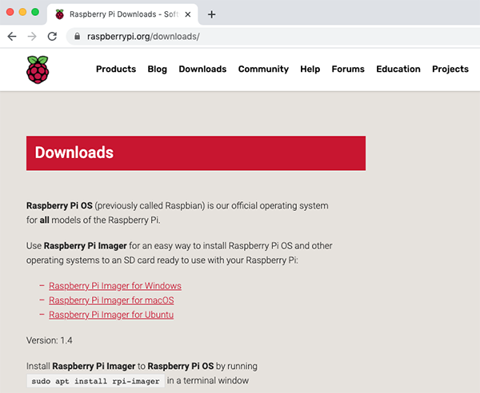
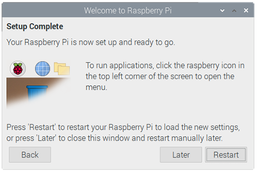

# INTRODUCTION

Here we will learn about the Rasberry Pi, what we can use it for and how to set it up. 

# What you will need 
## Which Raspberry PI? 
There are several models of Rasberry Pi, and for most people Rasberry Pi 4 Model B is the one to choose. Raspberry Pi 4 Model B is the newest, fastest, and easiest to use. 

Raspberry Pi 4 comes with 2 GB, 4 GB, or 8 GB of RAM. For most educational purposes and hobbyist projects, and for use as a desktop computer, 2G is enough.  

  
<strong>NOTE! </strong> I should add something here about which version of Raspberry is included in the kit.

Raspbery Pi Zero, Raspberry Pi Zero W, and raspberry Pi Zero WH are smaller and require less power, so they're useful for portable projects such as robots. It's generally easier to start a project with Raspberry Pi 4, and to move to Raspberry Pi Zero when you have a working prototype that a smaller Rasperry Pi would be useful for. 

  
<strong>NOTE!  </strong> 
  Add pictures of the other versions of raspberry Pi <strong>(Raspberry Pi Zero, Raspberry Pi Zero W, and Raspberry Pi Zero WH) </strong>
  

## A power supply 
To power the Raspberry 4, you need a power supply that provides at least 3.0 amps. The power adapter is included with the Raspberry Pi. You first need to plug the included adapter to a pour outlet and plug the USB type C end to the indicated port on the raspberry pi.  

  
<strong>NOTE!</strong>  
  Include pictures here 
  

## A microSD card 
Your Raspberry Pi needs an SD card to store all its files and theRaspberrry PI OS operating system. If its not included with the Raspberry Pi you need a microSD card with a capacity of at least 8 GB. 

  
<strong>NOTE!</strong>  
  Include pictures of the sd card, the slot on the raspberry here 
  

## A keyboard and a mouse 
To start using your Raspberry Pi, you need a USB keyboard and USB mouse. Once you've set up your Raspberry Pi, you can use a Bluethooth keyboard and mouse, but you'll need a USB keyboard and mouse for the first setup. 

## A TV or computer screen 
To view the Raspberry Pi OS desktop environment, you need a screen, and a cable to link the screen and your Raspberry Pi. The screen can be a TV or a computer monitor. If the screen has built-in speakers, Raspberry Pi is ableto use these to play sound. 

### HDMI 
Your Raspberry Pi has an HDMI output port that is compatible with the HDMI port of most modern TVs and computer monitors. 

**Raspberry Pi 4** has two micro HDMI ports, allowing you to connet two separate monitors. To connect it to a standard HDMI cable you need either a micro HDMI to HDMI cable, or a standard HDMI to HDMI cable plus a micro HDMI to HDMI adaper, to connect Raspberry Pi 4 to a screen. 

  
<strong>NOTE!</strong>  
  Include some pictures here.
  

## Set up your SD card 
If you have an SD card that doesn't have the Raspberrry Pi operating system on it yet, or if you want to reset your Raspberry Pi, you can easily install Raspberry Pi OS yourself. To do so, you need a computer that has an SD card port - most laptop and desktop computers have one. 

### The Rasperry Pi OS opearting system via the Raspberry Pi Imager 
#### Download and launch the Raspberry Pi Imager 
* Visit the Raspberry Pi downloads page 

* Click on the link for the Raspberrry Pi Imager that matches your operating system. 

* When the download ifnishes, click it to launch the installer. 

#### Using the Raspberry Pi Imager 
Anything that's stored on the SD card will be overwritten during formatting. If your SD card curently has any files on it, e.g. from an older version of Raspberry Pi OS, you may wish to back up these files first to prevent you from permanently losing them. 

**Note:** You will need to be connected to the internet the first time for the Raspberry Pi Imager to download the OS that you choose. That OS will then be stored for future offline use. Being online for later uses means that the Raspberry Pi imager will always give you the latest version. 

* Then simply click the `WRITE` button 
* Wait for the Raspberry Pi Imager to finish writing 
* Once you get the following message, you can eject your SD card 

## Connect your Raspberry Pi 
Now get everything connected to your Raspberry Pi. It's important to do this in the right orer, so that all your components are safe. 

* Insert the SD card you've set up with Raspberry Pi OS into the micro SD card slot on the underside of your Raspberry Pi. 

 * Find the USB connector end of your mouse and keyboard cable, and connect it to the USB port on the Raspberry Pi. 
 
 * Make sure your TV or computer screen is plugged in and turned on. 
 * Connect either the mini hdmi cable to the Raspberry Pi mini HDMI port labled `HDMI0` and plug the other side of the cable to the your TV or computer screen. 
 
   **NOTE:** Make sure you have used HDMI0 (nearest the power in port) rather than HDMI1. The second port can be used to connect an optional second screen in the same way. 
   

## Start up your Raspberry Pi 

Your Raspberry Pi doesn't have a power switch, As soon as you connect it to the power outlet, it will be turned on. 
* Plug the power supply into the socket and connect it to your Raspberry Pi's power port. 

  You should see a red LED light up on the Raspberry Pi, which indicates that Raspberry Pi is connected to power. As it starts up the Raspberry Pi OS desktop will appear in a few seconds. 

## Finishing the setup 

When you start your Raspberry Pi for the first time, the Welcome to Raspberry Pi application will pop up and guide you through the inital setup. 

  
* Click on **Next** to start the setup. 
* Set your **Countery, Langauge**, and **Timezone**, then click on **Next** again. 

  
* Enter a new password for your Raspberry Pi and click on **Next** 

* Connect to your wireless network by selecting its name, entering the password, and clicking on **Next** 

**Note:** Wait until the wireless connection icon appears and the correct time is shown before trying to update the software. 

* Click on **Next**, and let the wizard check for updates to Raspberry Pi OS and install them (this might take a little while) 

  
* Click on **Restart** to finish the setup. 
