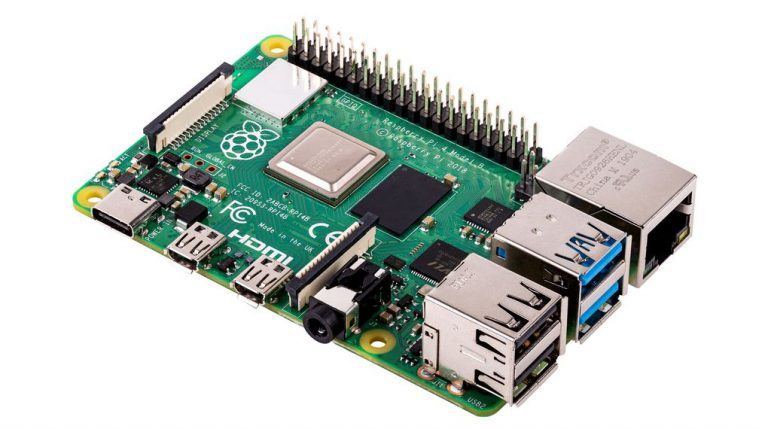
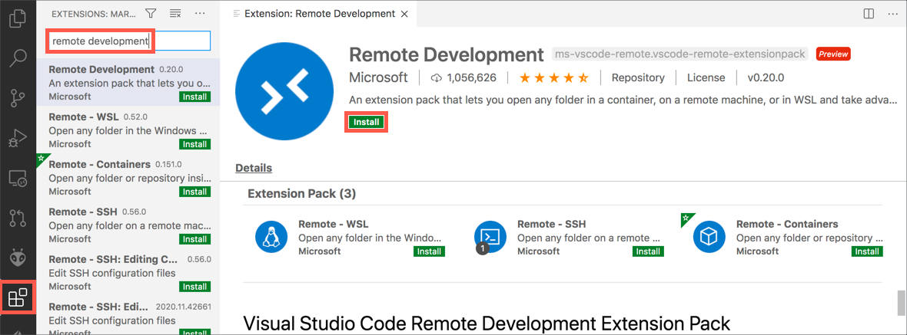
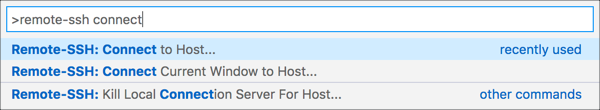
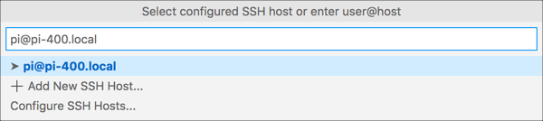
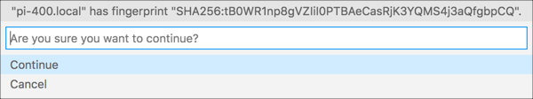
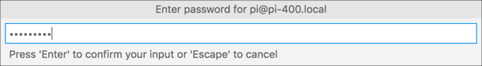

# Introduction 

In this section of the course we will see how to use visual studio code to remotelly write code on our Raspberry Pi. 

  
<strong>UPDATE! </strong> 
  Add more content here why its important to have remote access to the raspberry pi. 
  

Most Rasberry Pi applications are used a 'headless' device, which means that its not connected a display, mouse and keyboard like a normal desktop computer. The upside of using the raspberry pi this way is that it can be deployed anywhere. On the other side this might create some problems for us when we want to write a code or execute a program on the Raspberry Pi. 

# Remote Development with VS Code 
**Visual Studio Code, or VS Code** is a free, open source, developer's text editor with a whole swathe of extensions to support you coding in multiple languages, and provide tools to support your development. VS Code can be run on Windows, macOS, and of couce on a Raspberry Pi. 

One of the extensions that helps here is the **Remote SSH extension.**, part of a pack of remote development extensions. This extension allows you to connect to a remote device over SSH, and run VS Code as if you were running on that remote device. You see the remote file system, the VS Code terminal runs on the remote device, and you access the remote device's hardware. When you are debugging, the debug session runs on the remote device, but VS Code runs on the host machine. 

  
<strong>UPDATE! </strong> 
    Update link to Remote SSH extension
  

This means that we can run VS Code on Windows 10(or any operating system) and connect remotely to a Raspberry Pi 4 that is running headless. We can access the Raspberry Pi file system, run commands on a terminal connected to it , access whatever hardware the Raspberyy Pi has, and debug on it. 

**Note:**Remote SSH needs a Raspberry Pi 3 or 4. It is not supported on older Raspberry Pis, or on Raspberry Pi Zero. 

## Setting up Remote Development on the Raspberry Pi 

For remote development, your Raspberry Pi needs to be connected to  your network either by ethernet or Wifi , and have SSH enabled. You also neeed to know either the IP address of the Raspberry Pi. 

  
<strong>UPDATE! </strong> 
    Need more content here about how to enable SSH mode and get the IP address. Or maybe this point could be covered in the setting up of the raspberry.    
  

## Connecting to the Raspberry Pi from VS code 
Once the Raspberry Pi is setup, you can connect from VS Code on you Mac or PC. 

First make sure you have VS Code installed. If not, you can install it from the VS Code download pages.
 

  
<strong>UPDATE! </strong> 
  Fix the download link for visual studio.
  

From inside VS Code, you will need to install the Remote SSH extension. Select the Extensions tab from the sidebar menu, then search for *Remote Development*. Select the **Remote Development extension** and select **Install** button. 

Next you can connect to your Raspberry Pi. Launch the VS Code command palette using *Ctrl+Shift+P* on macOS. Search for and select **Remote SSH: Connect current window to host**

Enter the SSH connection details, using user@host. For the user, enter the Raspberry Pi username (the default is pi). For the host, enter the IP address of the Raspberry Pi, or the hostname. The hostname needs to end with .local, so if you are using the default hostname of raspberrypi, enter raspberrypi.local

The first time you connect, it will validate the fingerprint to ensure you are connecting to the correct host. Select **Continue** from this dialog. 

Enter your Raspberry Pi's password when asked. 

## Writing Code 

When you get to this step you should be all setup and ready to code on your Raspberry Pi. Start by opening a folder and creating your python file. 

  
<strong>UPDATE </strong> 
   Need more content here to show some steps on how to create the python file and run the first program. 
  

